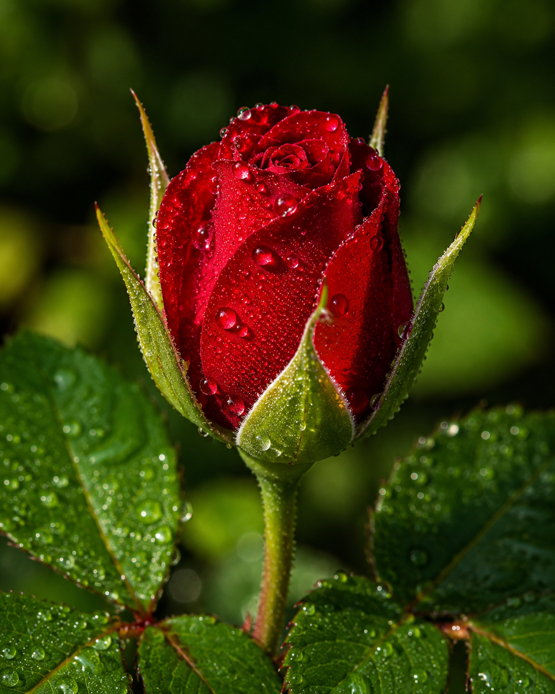

# 🌹 Ultra Photorealistic Scientific Botanical Rose Prompt

An ultra-photorealistic botanical prompt designed for modern AI image generation models.

---

## 📷 Example

---

## 📄 About

This repository contains a professional botanical prompt designed to generate an ultra-photorealistic deep crimson rose with museum-quality realism.

The prompt focuses on:

- Scientific botanical accuracy
- Physically Based Rendering (PBR)
- Macro photography realism
- National Geographic style
- Museum archive quality
- Commercial photography quality
- Natural lighting
- Focus stacked macro look

---

## 📂 Files

- **prompt.txt** → Complete prompt
- **rose-example.png** → Example image

---

## 🖼️ Recommended Models

- GPT Image
- FLUX
- Stable Diffusion XL
- Midjourney
- Ideogram

---

## License

MIT